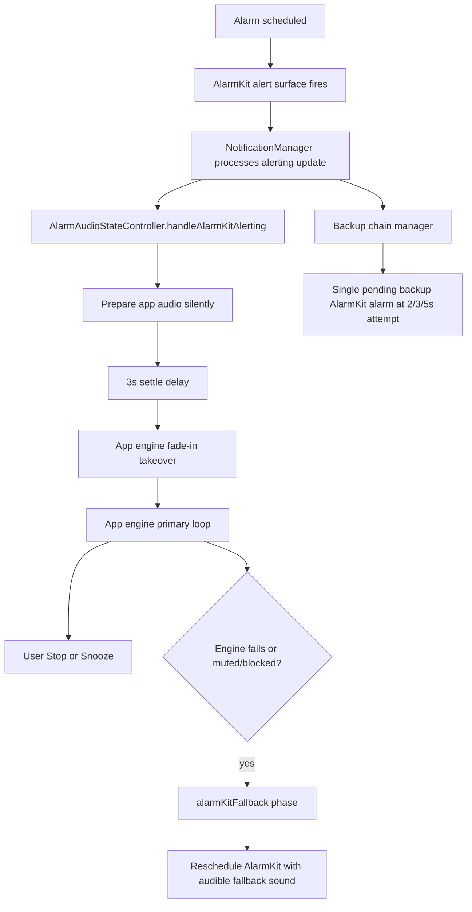

# Awayk Alarm Architecture Q&A

This document answers your 36 questions from the current codebase in this repo.
Rule followed: when not provable from code, I say `don't know`.

## Architecture at a glance

Core actors:
- `AlarmSchedulerIOS26AlarmKit`: schedules AlarmKit alarms and stages `alarmo_silence.caf` / fallback sounds.
- `NotificationManager`: receives alarm events, starts ring flow, manages backup chain and suppression.
- `AlarmAudioStateController`: state machine and takeover timing.
- `AlarmContinuousAudioEngine`: resolves/plays audio, fade-in, fallback when sound decode fails.
- `AlarmBackgroundAudioBridge`: keeps audio continuity when app state transitions.
- `AlarmCustomUIHandoffStore`: maps AlarmKit surface UUID <-> source alarm UUID.

---

## Section 1 - The basics of who does what

1. **Who fires first?**
- AlarmKit surface fires first. The app engine does not start audible output first.
- AlarmKit’s update is processed in app code, then app audio prepares and later takes over.

2. **Why use silent `alarmo_silence.caf`?**
- AlarmKit is used for reliable system-level alarm scheduling/surface behavior (lock screen, system alarm lifecycle).
- Silent sound avoids double-audio while app engine is the intended audible owner.

3. **Exact trigger for app engine takeover?**
- Trigger path is AlarmKit alerting update -> `NotificationManager.processAlarmKitAlertingAlarm` -> `AlarmAudioStateController.handleAlarmKitAlerting(...)`.
- That method prepares engine silently and schedules delayed takeover (`scheduleDelayedTakeover`) after settle delay.

4. **Phase walkthrough**
- `waitingForAlarmKit`: session exists, waiting for alarm alerting signal.
- `alarmKitSettling`: AlarmKit alerting received; brief stabilization window.
- `appEnginePreparing`: app engine prepared silently with selected sound.
- `appEngineFadingIn`: app engine starts audible fade-in takeover.
- `appEnginePrimary`: app engine is confirmed primary audible owner.
- `alarmKitFallback`: app engine failed/unavailable path; rely on AlarmKit audible fallback.
- `stopped`: terminal state after stop/snooze/end; session cleared.

5. **Why 3 seconds? What if 0?**
- Code enforces `alarmKitSettleDelay = 3.0` before takeover.
- Purpose from behavior: let AlarmKit/UI/session settle before app engine fade-in.
- If `0`, likely higher risk of race/session contention/abrupt handoff. Exact empirical reason from original tuning is `don't know`.

---

## Section 2 - Sound file resolution

6. **4 search locations (order)**
- 1) `Documents/CustomSounds` (user/imported custom files).
- 2) `Application Support/Assets` (downloaded hosted assets/catalog).
- 3) `Library/Sounds` (staged system/alarm sounds, including AlarmKit-staged files).
- 4) App bundle recursive scan (packaged resources).

7. **`Alarm.soundName` exact string for Cockpit Alert?**
- Exact stored raw string for that specific UI choice in your current data is `don't know` unless we inspect a concrete saved alarm record.
- Resolution logic normalizes both requested and candidate names by lowercasing, removing extension, and keeping only letters/numbers.
- Example: `"Cockpit Alert"` -> `"cockpitalert"`.

8. **`findFallbackSound()` purpose and behavior**
- Used when requested sound is missing/invalid or blocked internal silent selection.
- It first prefers `BundledSounds/ringtones`.
- Then bundle-wide scan preferring non-SFX; if only SFX exists, returns SFX; if only silent remains, returns silent.

9. **File size > 1000 bytes check**
- Defensive check against tiny/invalid/corrupt audio assets.
- A tiny/truncated file would trigger it; engine treats selected sound as unusable and falls back.

10. **`HostedAssets/sounds` bundled or downloaded?**
- In this repo, both paths exist:
- `HostedAssets/sounds` is included in Xcode resources (`project.pbxproj` has `sounds in Resources`).
- Also remote catalog is configured (`AppRootView` GitHub `catalog.json`) and downloaded assets are stored in `Application Support/Assets`.
- Download happens when `AssetManager` fetches catalog/prefetch logic runs in app startup flow.

---

## Section 3 - Fresh install and reinstall

11. **Fresh install at 6:59am for 7:00 alarm**
- Device should have bundled sounds, staged silent AlarmKit file (after scheduler setup), and possibly prefetch downloads if startup fetch completed.
- Alarm playback intent: AlarmKit surface + app engine takeover with selected sound.
- If selected sound unavailable, fallback resolution applies.

12. **Delete + reinstall: lost vs preserved**
- Lost: app container data (Documents, Library, Application Support), downloaded assets, `UserDefaults`, alarm JSON store, handoff map.
- Preserved: `don't know` for anything external like iCloud/Keychain because this alarm flow data path shown here is local container based.

13. **After reinstall, skip onboarding, alarm fires**
- New install has new local stores; old mappings/settings are gone.
- Code path still works with source/surface fallback behavior because missing mapping returns surface ID as source ID.
- Sound plays from available selected/bundled/fallback chain depending on what that alarm references and what exists locally.

---

## Section 4 - UUID mapping

14. **What is `AlarmCustomUIHandoffStore`?**
- A persisted mapper that links AlarmKit surface alarm UUIDs back to the app’s source alarm UUIDs across handoff events.

15. **When mapping is written?**
- On `AlarmCustomUIHandoffStore.request(alarmID:surfaceAlarmID:)` calls.
- Triggered during schedule/respawn/backup surface creation paths.
- Maps `surfaceAlarmID -> sourceAlarmID` and stores pending request/timestamp.

16. **Surface UUID vs source UUID**
- Source UUID: canonical app alarm identity.
- Surface UUID: specific AlarmKit surface/alarm instance (original or backup/respawn instance).
- They differ because backup/respawn alarms can be new AlarmKit IDs tied to one logical source alarm.

17. **Mapping expiry window and expired behavior**
- Current max age is `4 * 60 * 60` (4 hours).
- On lookup, if entry age exceeds max age, mapping is dropped and code returns surface ID as fallback source ID.
- That means correlation can degrade, but flow still attempts to proceed with fallback identity.

18. **UserDefaults lifecycle**
- Force quit: preserved.
- Device reboot: preserved.
- App delete: removed with app container.

---

## Section 5 - AlarmKit fallback

19. **When `shouldUseAudibleFallback` is true?**
- True when `AlarmAudioStateController.shared.phase == .alarmKitFallback` at scheduling time.
- True: AlarmKit config uses staged audible fallback sound.
- False: AlarmKit config uses silent `alarmo_silence.caf`.

20. **Backup alarm chain**
- One pending backup per source at a time.
- Scheduling attempts use delays `[2.0, 3.0, 5.0]` until one schedules.
- Purpose: resilience when app engine is unhealthy/suspended or recovery is needed.

21. **If app engine fails fully in fallback mode, what sound plays?**
- AlarmKit plays the staged fallback audible sound selected by scheduler fallback resolution.
- It is staged into `Library/Sounds` by AlarmKit scheduler staging logic.

---

## Section 6 - Silent mode and volume

22. **`AVAudioSession` `.playback` practical effect**
- Playback category is intended to continue in silent-switch scenarios.
- In this architecture, alarms are designed to ring with `.playback`; exact behavior may still depend on route/system constraints.

23. **Volume gate (`outputVolume <= 0.01`, backgrounded)**
- App engine path is treated as effectively muted; recovery path allows AlarmKit fallback behavior.
- Sound then depends on AlarmKit mode: silent in normal mode, audible in fallback mode.
- To ensure audibility: user needs non-zero system output volume.

24. **Volume changes after alarm creation**
- Runtime checks use current `AVAudioSession.sharedInstance().outputVolume`.
- So behavior adapts to current output volume at fire time, not the value at creation time.

---

## Section 7 - Foreground vs background

25. **Foreground vs background path**
- Foreground can fire via `AlarmForegroundScheduler` timer and `handleForegroundTimerAlarm` path.
- Background/locked path is driven mainly by AlarmKit alerting updates and bridge/recovery logic.

26. **Why dismiss AlarmKit when app active + app engine primary/fading?**
- To avoid duplicate/conflicting surfaces and keep app-owned ringing UX clean.
- Without dismissal, user can see conflicting alarm surfaces while app already controls audio.

27. **User locks phone after alarm UI appears**
- Engine may continue if session/bridge remains healthy.
- `AlarmBackgroundAudioBridge` and backup/respawn logic exist to keep or recover alarm audibility in background transitions.

---

## Section 8 - Bridge audio

28. **What is `AlarmBackgroundAudioBridge`?**
- A background continuity layer coordinating session/audio state across app lifecycle transitions for alarm runs.
- It addresses lifecycle/transition reliability gaps beyond a plain one-shot `AVAudioPlayer` call.

29. **When bridge starts/stops**
- Starts during alarm ring flow/background continuity paths when ring coordinator engages it.
- Stops on stop/snooze/flow teardown via ring stop internals.

30. **If bridge fails to start**
- Consequence: reduced continuity/reliability for background alarm audio path.
- Recovery can rely more on AlarmKit fallback/backup chain.

---

## Section 9 - State machine edge cases

31. **Why strict transitions?**
- Prevents illegal phase jumps and stale async callbacks from corrupting ring ownership.
- Without guard, delayed callbacks could re-enter invalid phases and cause double starts/stops.

32. **If AlarmKit fires but `handleAlarmKitAlerting()` never called**
- State controller never records settle/prepare/takeover for that run.
- App engine takeover may not occur; user may only get AlarmKit behavior/recovery paths.

33. **Can `appEnginePrimary` go back to `alarmKitFallback`?**
- Yes, allowed by transition table.
- Real-world trigger: engine failure/unhealthy condition/interruption path that records fallback.

---

## Section 10 - Stop and snooze

34. **Press Stop effects**
- (a) App audio engine: stopped/teardown.
- (b) AlarmKit alarm: linked surfaces dismissed/canceled as part of stop flow.
- (c) State phase: transitions to `stopped`.
- (d) Pending backup alarms: canceled (`cancelBackupAlarmChain` / all chains cleanup).

35. **Press Snooze rescheduling mechanism**
- Snooze path preserves needed session context, stops active ring flow, then schedules snooze through scheduler facade (`scheduleSnooze`).
- It is not only a local notification shortcut; it goes through app scheduler path (AlarmKit-capable scheduling flow).

36. **`isAlarmFlowSuppressed()` flag meaning**
- Set by terminal user actions (stop/snooze/dismiss tracking window logic).
- It blocks stale callbacks from re-starting alarm flow immediately after termination.
- Without it, racey relaunch/respawn/alert callbacks could resurrect a just-stopped alarm.

---

## Notes on unknowns

Items explicitly marked `don't know` are unknown because code alone here does not prove a single runtime value or environment-dependent behavior without additional runtime traces/user data snapshots.

## Key file references

- `/Users/rukesh/Documents/projects/alarmo/awayk/alarmo/Shared/Services/AlarmAudioStateController.swift`
- `/Users/rukesh/Documents/projects/alarmo/awayk/alarmo/Shared/Services/AlarmContinuousAudioEngine.swift`
- `/Users/rukesh/Documents/projects/alarmo/awayk/alarmo/Shared/Services/AlarmSchedulerIOS26AlarmKit.swift`
- `/Users/rukesh/Documents/projects/alarmo/awayk/alarmo/Shared/Services/NotificationManager.swift`
- `/Users/rukesh/Documents/projects/alarmo/awayk/alarmo/Shared/Services/AlarmBackgroundAudioBridge.swift`
- `/Users/rukesh/Documents/projects/alarmo/awayk/alarmo/Shared/Services/AlarmSchedulingCore.swift`
- `/Users/rukesh/Documents/projects/alarmo/awayk/alarmo/App/AppRootView.swift`
- `/Users/rukesh/Documents/projects/alarmo/awayk/alarmo.xcodeproj/project.pbxproj`
