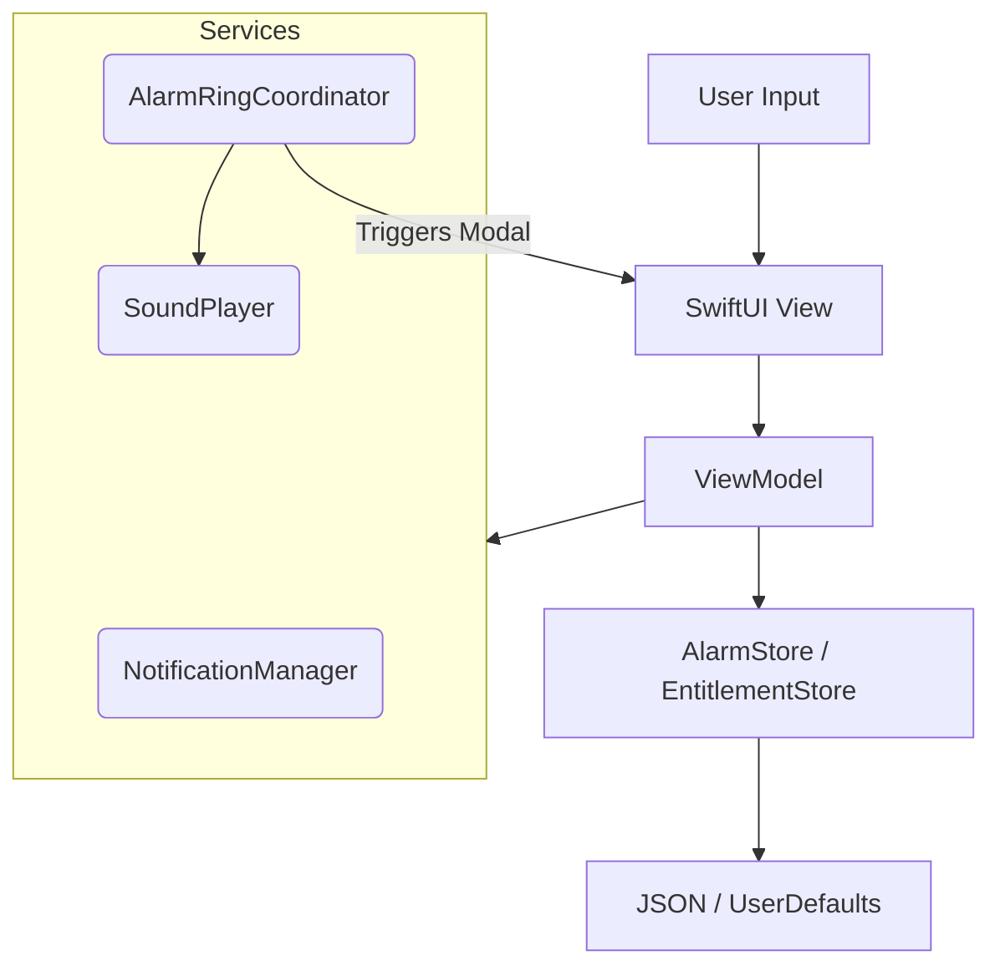
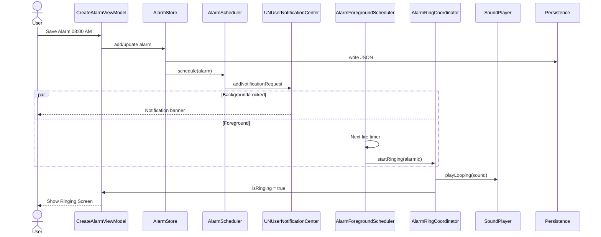
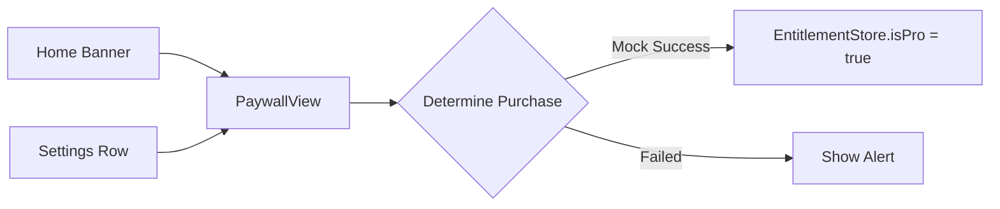

# Alarmo Code Map & Architecture Guide

> **Last Updated:** Jan 2026
> **Version:** 1.2

This document is the "source of truth" for the Alarmo iOS codebase. It summarizes the architecture, state management, navigation flows, and the main feature areas.

---

## 🏗 Repo Tree (Annotated)

```text
alarmo/
├── App/                        # App entry + root routing
│   ├── AlarmoApp.swift         # @main entry point, DI container
│   ├── AlarmAppDelegate.swift  # UNUserNotificationCenter delegate + app lifecycle hooks
│   └── AppRootView.swift       # Root view + routing logic
├── Core/                       # System infrastructure + UI primitives
│   ├── Theme/                  # Colors, fonts, spacing, radii, shadows
│   ├── UIComponents/           # Shared SwiftUI components (buttons, cards, etc.)
│   └── Utilities/              # Helpers (TimeFormatters, logging, etc.)
├── Data/                       # Persistence & repositories
│   ├── Catalog/                # Sound/Wallpaper loading + config
│   └── Repositories/           # Sound/Catalog/UserSettings repositories
├── Features/                   # UI modules
│   ├── Alarms/                 # Alarm editor + ringing UI
│   │   ├── HabitAlarm/         # Habit alarm flow
│   │   ├── QuickAlarm/         # Quick alarm flow
│   │   └── Missions/           # Mission pickers + configs
│   ├── Games/                  # Mini-games (e.g., Memory Match)
│   ├── Home/                   # Main tab container + Alarm list
│   ├── Missions/               # Mission list + mission detail flows
│   ├── Onboarding/             # First-launch flow + selections
│   ├── Paywall/                # Pro/free trial paywall flows
│   ├── Plan/                   # Plan/Task/Habit/Focus planning UI
│   ├── Settings/               # Settings screens + managers
│   ├── Sounds/                 # Sound selection flows
│   ├── Timer/                  # Timer mode (Pomodoro/Stopwatch)
│   ├── Timers/                 # Timer placeholder screens
│   ├── Upsell/                 # Celebration overlay + discount offer
│   └── Wallpapers/             # Wallpaper selection flows
├── Resources/                  # Bundled assets
│   ├── BundledSounds/          # Ringtone files
│   └── BundledWallpapers/      # Wallpaper images
└── Shared/                     # Reusable domain logic
    ├── Models/                 # Core models (Alarm, AlarmMission, etc.)
    ├── Protocols/              # Service protocols (Clock, etc.)
    └── Services/               # AlarmStore, schedulers, ring coordinator, etc.
```

---

## 🏛 Architecture Overview

Alarmo uses a **MVVM** structure with root-level service coordination.

### Key Principles

1. **Single Source of Truth**: `AlarmStore` owns alarm data. `AppRootView` owns global state (`@StateObject`).
2. **Dependency Injection**: Global services are created in `AppRootView` and injected via initializers or `EnvironmentObject`.
3. **Persistence**: Core models are `Codable` and saved to JSON in the Documents directory.

### High-Level Diagram



---

## 🗺 UI & Navigation Map

* **Root Switch**: `AppRootView` switches between onboarding and main tabs.
* **Tabs**: Custom tab bar; Alarm tab is primary.
  * Current order: Alarm, Timer, Sleep, Plan, Report, Setting (`Features/Home/MainTabContainerView.swift`).
* **Modals**: Paywalls, alarm editor, ringing screen, timer sheets.

### Navigation Graph

```mermaid
graph TD
    Root[AppRootView] --> Check{Onboarding Complete?}
    Check -- No --> Onboarding[OnboardingFlowView]
    Check -- Yes --> Tabs[MainTabContainerView]

    subgraph Tabs
        Home[Alarm List]
        Plan[Plan (Tasks/Habits/Focus)]
        Sleep[Sleep (Placeholder)]
        Morning[Morning (Placeholder)]
        Report[Report (Placeholder)]
        Settings[Settings (Placeholder)]
        Timer[TimerRootView]
        Missions[Missions List]
        Games[Games List]
    end

    Root -- "isRinging == true" --> Ringing[AlarmRingingView (FullScreen)]

    Home -- "+" Tap --> CreateAlarm[CreateWakeUpAlarmView]
    CreateAlarm -- "Save" --> Home

Tabs --> Paywall[PaywallView (Sheet)]

--- 

# 🔍 Latest Feature Notes

* **Mission System** includes Typing, Find Color Tiles, QR/Barcode, Steps, Memory Match, and Tic Tac Toe (see `Features/Alarms/Missions/*`).
* **Timer mode** (Pomodoro + Stopwatch) lives inside `Features/Timer/` and is reachable from the main tab bar, with multiple sheets (presets, notes, settings, records).
* **Plan** feature provides Task/Habit/Focus creation and planning UI (see `Features/Plan/*`) and uses `Shared/Models/PlanModels.swift` + `Shared/Services/TaskStore.swift`.
* **Upsell/Discount flows** rely on `TrackingPermissionService`, `DiscountPaywallView`, and `CelebrationOverlayView`.
```

---

## 🔄 State Management & Data Flow

Global state is lifted to `AppRootView`.

| Object | Type | Role | Scope |
| :--- | :--- | :--- | :--- |
| **AlarmStore** | `@StateObject` | Creation, deletion, persistence of alarms | Global |
| **AlarmRingCoordinator** | `@StateObject` | Ringing state, audio, haptics | Global |
| **AlarmForegroundScheduler** | `@StateObject` | Foreground ring timer | Global |
| **NotificationManager** | `@StateObject` | UNUserNotificationCenter delegate + logging | Global |
| **AppPreferences** | `@StateObject` | UserDefaults wrapper | Global |
| **TaskStore** | `@StateObject` | Plan/Task/Habit persistence | Global |
| **NavigationStore** | `@StateObject` | Cross-feature navigation flags | Global |

---

## ⏰ Alarm Lifecycle (End-to-End)



### Critical Files

* `Shared/Services/AlarmStore.swift`: JSON-backed alarm persistence.
* `Shared/Services/AlarmRingCoordinator.swift`: Ringing UI + sound control.
* `Shared/Services/AlarmForegroundScheduler.swift`: Foreground timer.
* `Features/Alarms/AlarmRingingView.swift`: Full-screen alarm UI.

---

## 💰 Subscription / Paywall Flows

**Current Status:** Mock purchase flow. `MockPurchaseService` is active by default.

### Flow



---

## 💾 Data Models

### `Alarm.swift`

* **ID**: `UUID`
* **Scheduling**: `hour`, `minute`, `repeatMask` (weekday bitmask)
* **Assets**: `soundName`, `wallpaperId`
* **State**: `enabled`, `snoozeCount`
* **Missions**: `missions: [AlarmMission]`

### `AlarmMission.swift`

Core mission payload:
* `type`, `difficulty`, `rounds`

### `AlarmDraft.swift`

Draft for editors:
* name, emoji, time, repeat rules
* `soundName`, `soundVolume`, `wallpaperId`
* reminders, snooze, gentle wake-up
* `missions`

### `PlanModels.swift`

Plan domain:
* task/habit/focus items
* appearance + schedule metadata
* task state managed by `TaskStore`

---

## ⚙️ Services & System Integrations

### 1. Notifications (`NotificationManager.swift`)

* Requests permissions, logs settings, handles delegate callbacks.

### 2. Audio (`SoundPlayer.swift`)

* AVAudioPlayer looped playback with volume control and fallback sound lookup.

### 3. Storage (`AlarmStore.swift`, `AppPreferences.swift`)

* Alarms persisted to JSON.
* AppPreferences stores flags (onboarding, paywall gates, defaults).

---

## 🎮 Games & Missions

### Games

* `Features/Games/` contains mini-games (Memory Match, etc.).
* Games list launches game previews with consistent pastel UI style.

### Missions

* `Features/Missions/` contains mission list and detail flows.
* `Features/Alarms/Missions/` contains mission selection + per-mission configs:
  * `FindColorTiles/*`
  * `Typing/*`
  * `QRBarcode/*`
  * `Steps/*`
  * `MemoryMatch/*`
  * `TicTacToe/*`

---

## ⏱ Timer Mode

* `Features/Timer/` contains Pomodoro + Stopwatch flows.
* Sheets: duration picker, frequently used presets, focus notes, settings, records.
* `Features/Timers/` holds placeholder screens for future timer expansion.

---

## 🔎 Change Hotspots

These files change the most:

1. `Features/Alarms/CreateWakeUpAlarmView.swift`
2. `Shared/Services/AlarmStore.swift`
3. `Features/Onboarding/OnboardingViewModel.swift`
4. `Features/Paywall/PaywallView.swift`
5. `App/AppRootView.swift`
6. `Features/Home/HomeView.swift`
7. `Features/Timer/*`

---

## 📝 Codex Implementation Notes

### Conventions

* **Views**: `Features/<FeatureName>/...`
* **ViewModels**: colocated with views.
* **Utilities**: `Shared/Services` or `Core/Utilities`.
* **Assets**: Use tokens from `Core/Theme`.

### Where to Implement New Features?

* **New Screen**: Add to `Features/` and route from the owning parent view.
* **New Global Service**: Add to `Shared/Services` and inject via `AppRootView`.

### Debugging

* Most services have `debugLogging` switches and print diagnostics.
* Check app sandbox `Documents/alarms.json` for persisted alarms.

---

## ❓ Open Questions / TODOs

* **StoreKit Integration**: real purchase flow still pending.
* **Background Ringing**: custom snooze/stop depends on app launch.
* **Deep Linking**: no URL scheme handler yet.
