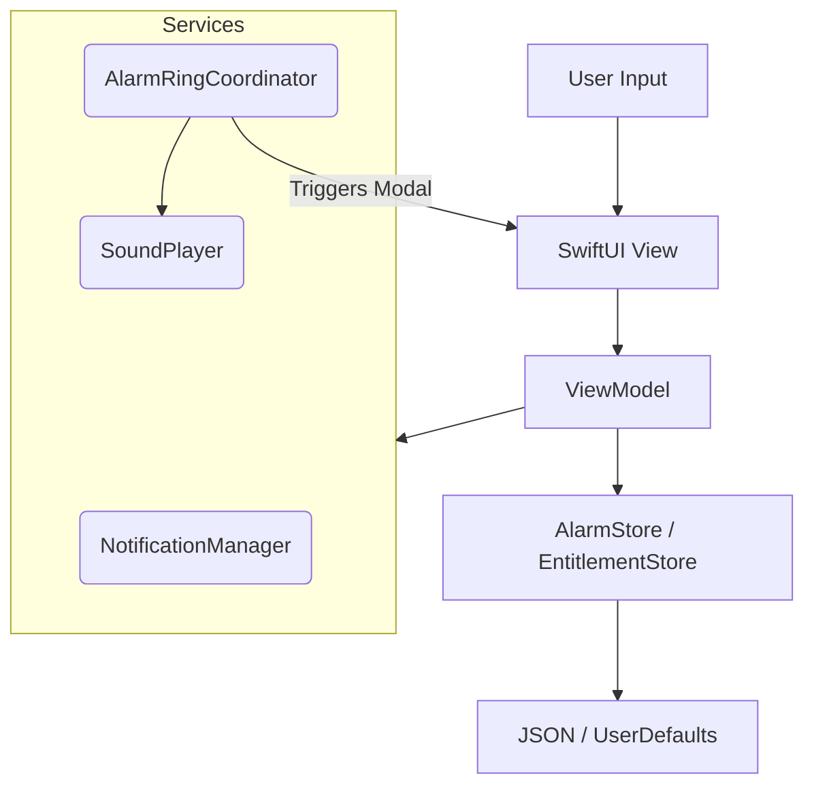
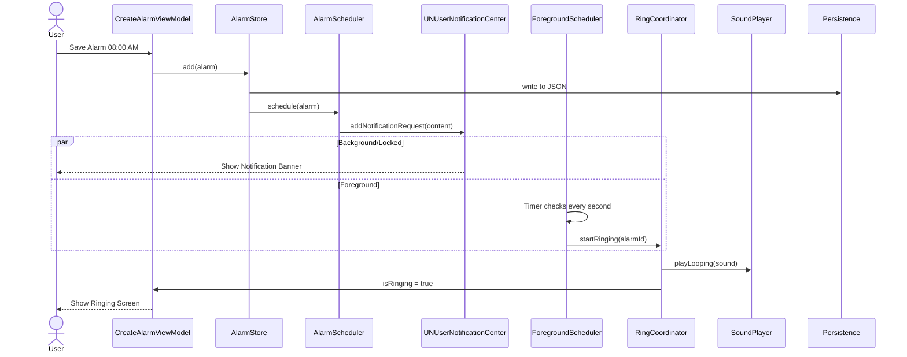
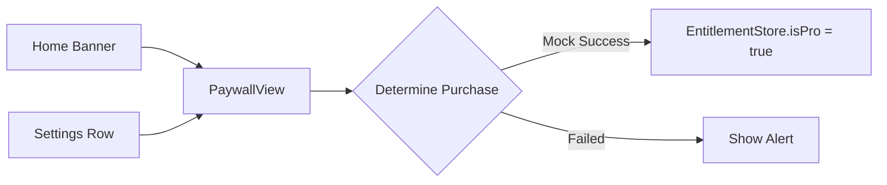

# Alarmo Code Map & Architecture Guide

> **Last Updated:** Jan 2026
> **Version:** 1.0

This document serves as the "source of truth" for understanding the Alarmo iOS codebase. It covers architecture, state management, navigation flows, and key implementation details.

---

## 🏗 Repo Tree (Annotated)

```text
alarmo/
├── App/                  # App Entry & Root
│   ├── AlarmoApp.swift       # @main entry point, DI Container
│   └── AppRootView.swift     # Root View (StateObject owner), Routing logic
├── Core/                 # System infrastrucutre
│   ├── Theme/                # Colors, Fonts, Layout constants
│   └── Utilities/            # Helpers (AlarmDebug.swift, TimeFormatters.swift)
├── Data/                 # Persistence & Repositories
│   ├── Catalog/              # Sound/Wallpaper loading logic
│   └── Repositories/         # SoundCatalogRepository
├── Features/             # UI Screens (Modules)
│   ├── Alarms/               # Alarm List & Edit/Create Screens
│   ├── Home/                 # Main Tab Bar Container
│   ├── Onboarding/           # First-launch flow
│   ├── Paywall/              # Subscription screens
│   └── Sounds/Wallpapers     # Picker screens
├── Resources/            # Bundled Assets
│   ├── BundledSounds/        # Ringtones files
│   └── BundledWallpapers/    # Wallpaper images
└── Shared/               # Reusable Logic
    ├── Models/               # Core Data Models (Alarm.swift)
    ├── Services/             # Business Logic (AlarmStore, RingCoordinator)
    └── UIComponents/         # Shared SwiftUI components (Buttons, Cards)
```

---

## 🏛 Architecture Overview

Alarmo follows a **MVVM (Model-View-ViewModel)** pattern with a **Coordinator-like** state triggers at the root level.

### Key Principles

1. **Single Source of Truth**: `AlarmStore` owns the alarm data. `AppRootView` owns the high-level app state instances (`@StateObject`).
2. **Dependency Injection**: Dependencies are created in `AppRootView` and passed, usually via `init` (Dependency Injection) or `EnvironmentObject`.
3. **Persistence**: `Codable` structs saved to JSON files in the Documents directory.

### High-Level Diagram



---

## 🗺 UI & Navigation Map

The app uses a hybrid navigation approach:

* **Root Switch**: `AppRootView` switches between `OnboardingFlowView` and `MainTabContainerView`.
* **Tabs**: Custom Tab Bar implementation.
* **Modals**: Ringing screen is a global `fullScreenCover`.

### Navigation Graph

```mermaid
graph TD
    Root[AppRootView] --> Check{Onboarding Complete?}
    Check -- No --> Onboarding[OnboardingFlowView]
    Check -- Yes --> Tabs[MainTabContainerView]
    
    subgraph Tabs
        Home[Alarm List]
        Sleep[Sleep (Placeholder)]
        Morning[Morning (Placeholder)]
        Report[Report (Placeholder)]
        Settings[Settings (Placeholder)]
    end
    
    Root -- "isRinging == true" --> Ringing[AlarmRingingView (FullScreen)]
    
    Home -- "+" Tap --> CreateAlarm[CreateWakeUpAlarmView]
    CreateAlarm -- "Save" --> Home
    
    Tabs --> Paywall[PaywallView (Sheet)]
```

---

## 🔄 State Management & Data Flow

Global state is lifted to `AppRootView`.

| Object | Type | Role | Scope |
| :--- | :--- | :--- | :--- |
| **AlarmStore** | `@StateObject` | Creation, Deletion, Persistence of Alarms | Global, passed to Home |
| **AlarmRingCoordinator** | `@StateObject` | Manages Ringing State, Audio, Haptics | Global EnvironmentObject |
| **NotificationManager** | `@StateObject` | Manages UNUserNotificationCenter | Global EnvironmentObject |
| **AppPreferences** | `@StateObject` | Wrapper for UserDefaults (Onboarding flags) | Global |

---

## ⏰ Alarm Lifecycle (End-to-End)

The lifecycle of an alarm from creation to ringing involves several services working in concert.



### Critical Files

* `Shared/Services/AlarmStore.swift`: The database.
* `Shared/Services/AlarmRingCoordinator.swift`: The "brain" of the ringing experience.
* `Shared/Services/AlarmForegroundScheduler.swift`: Polls for alarms when the app is open (since notifications don't fire banners in foreground).

---

## 💰 Subscription / Paywall Flows

**Current Status:** Mocked. `StoreKitPurchaseService` exists but returns empty products. `MockPurchaseService` is used by default.

### Data Model

* **PaywallProduct**: Struct representing a store product.
* **EntitlementStore**: Checks `UserDefaults` for "isPro" bool.

### Flow



---

## 💾 Data Models

### `Alarm.swift`

The core entity.

* **ID**: `UUID`
* **Scheduling**: `hour`, `minute`, `repeatMask` (Bitmask for days).
* **Assets**: `soundName`, `wallpaperId`.
* **State**: `enabled`, `snoozeCount`.

### `PurchaseProduct.swift`

Representation of an IAP product (Yearly, Monthly, Lifetime).

---

## ⚙️ Services & System Integrations

### 1. Notifications (`NotificationManager.swift`)

* **Responsibilities**: Request permissions, handle delegate methods, sync with `RingCoordinator`.
* **Key Behavior**: When a user taps a notification, it triggers the `RingCoordinator` to show the full-screen UI.

### 2. Audio (`SoundPlayer.swift`)

* **Technology**: `AVAudioPlayer`.
* **Features**: Looping playback, volume control, fading.

### 3. File System (`FileStorageService.swift`)

* **Used for**: Saving user-picked photos (Profile/Wallpapers).
* **Location**: `Documents/user_allocations/`.

---

## 🔎 Change Hotspots

These files are modified most frequently:

1. **`CreateWakeUpAlarmView.swift`**: The most complex form in the app. Changes here affect alarm creation logic.
2. **`AlarmStore.swift`**: Logic for sorting, persisting, and calculating `nextFireDate`.
3. **`OnboardingViewModel.swift`**: Often changed to adjust the first-run funnel.
4. **`PaywallView.swift`**: Adjusting UI for conversion optimization.
5. **`AppRootView.swift`**: Adding new global state or top-level sheets.

---

## 📝 Codex Implementation Notes

### Conventions

* **Views**: Placed in `Features/<FeatureName>/`.
* **ViewModels**: Colocated with Views.
* **Utilities**: Placed in `Shared/Services` or `Core/Utilities`.
* **Assets**: Use `Colors.constants` and `Fonts.constants` in `Core/Theme`.

### Where to Implement New Features?

* **New Screen**: Create new folder in `Features/`. Add entry point in `MainTabContainerView` or routing logic in the relevant parent view.
* **New Global Service**: Create in `Shared/Services`. Initialize in `AppRootView` and inject via Environment.

### Debugging

* **Logging**: Most services have a `debugLogging` boolean property. Set to `true` to see console output.
* **Files**: Check the App Sandbox Documents directory to view `alarms.json`.

### Testing

* Unit tests live in `alarmoTests/`.
* `SoundCatalogRepository` and `WallpaperCatalogLoader` have tests for bundle resource loading.

---

## ❓ Open Questions / TODOs

* **StoreKit Implementation**: `StoreKitPurchaseService` handles `loadProducts` but `purchase` logic needs to be wired to real Apple APIs.
* **Background Ringing**: Currently relies on standard Local Notifications. Custom logic (snooze/stop) requires app launch.
* **Deep Linking**: No explicit URL scheme handler yet.
